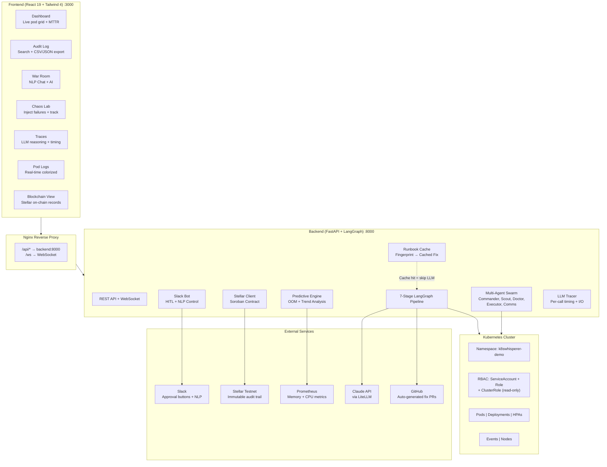
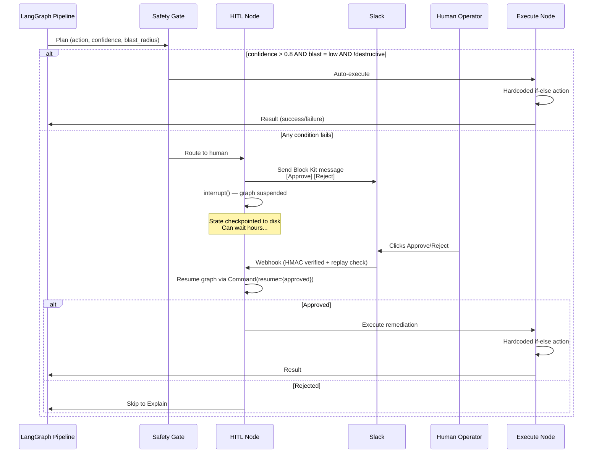
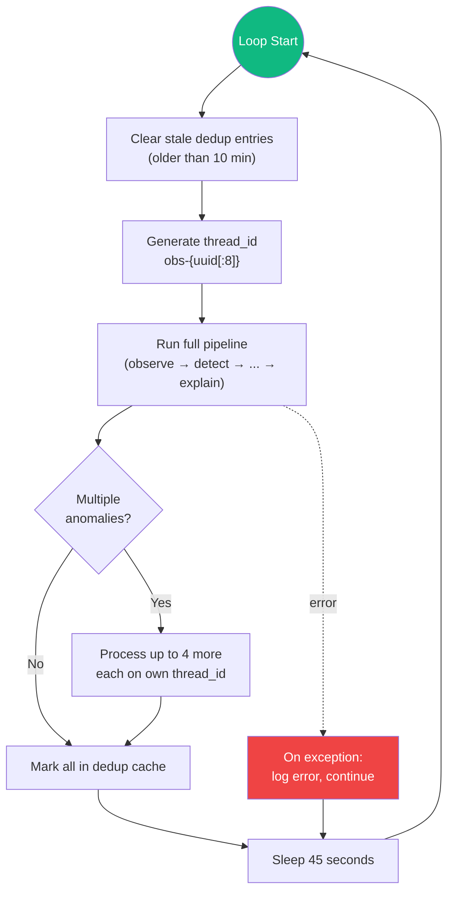
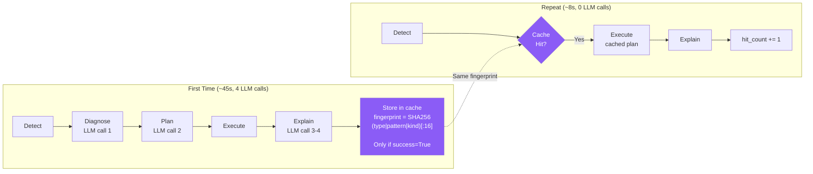
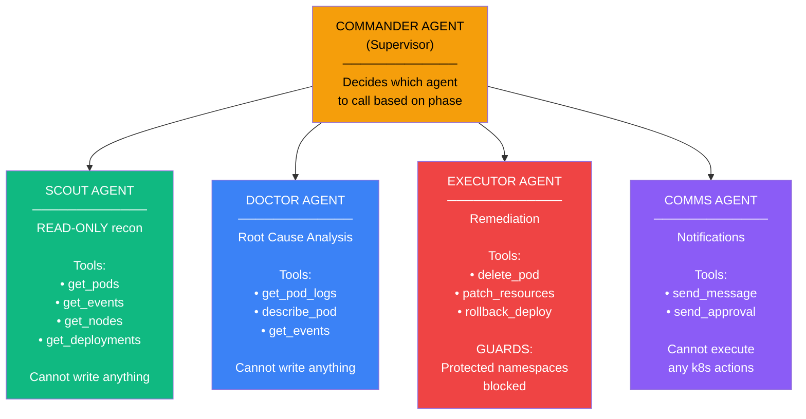
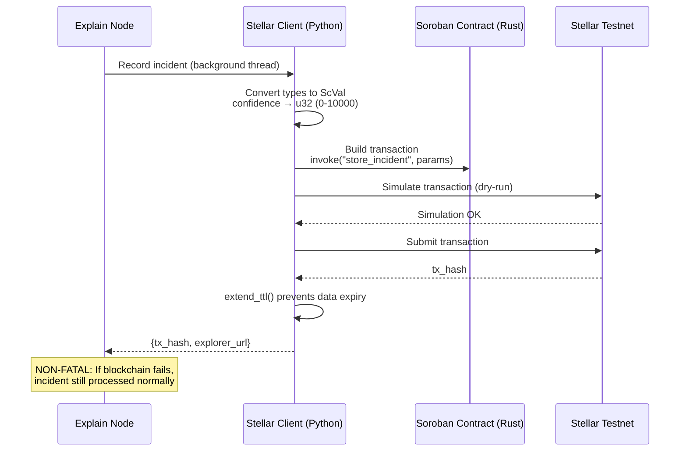
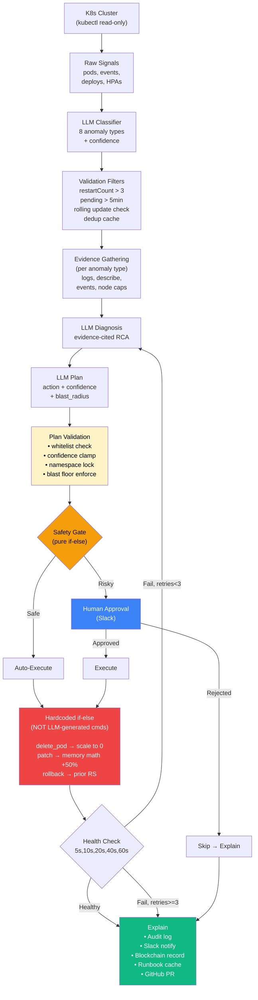

# Sentinel — Architecture & How Everything Works

## High-Level System Architecture

---

## The 7-Stage Pipeline (Core Brain)

This is the exact LangGraph state machine. Runs every 45 seconds.

```mermaid
flowchart TD
    START((START)) --> OBSERVE

    OBSERVE["1. OBSERVE<br/>────────────<br/>Poll K8s API:<br/>• Pod statuses<br/>• Events (last 5min)<br/>• Deployment rollouts<br/>• HPA scaling status<br/>• Node conditions<br/><br/>Skip: kube-system,<br/>kube-public, etc.<br/><br/>READ-ONLY. No writes."]

    OBSERVE --> DETECT

    DETECT["2. DETECT<br/>────────────<br/>LLM classifies into 8 types<br/><br/>Validates:<br/>• restartCount > 3<br/>• pending > 5 min<br/>• rolling update filter<br/>• 10-min dedup cache<br/>• confidence >= 0.5"]

    DETECT -->|"No anomalies"| END1((END))
    DETECT -->|"Anomalies found"| CACHE_CHECK

    CACHE_CHECK{"Runbook Cache<br/>────────────<br/>SHA256(type|pattern|<br/>resource)[:16]<br/><br/>Only returns if<br/>previous success=True"}

    CACHE_CHECK -->|"CACHE HIT<br/>0 LLM calls, ~8s"| EXECUTE
    CACHE_CHECK -->|"CACHE MISS"| DIAGNOSE

    DIAGNOSE["3. DIAGNOSE<br/>────────────<br/>Evidence per anomaly type:<br/><br/>CrashLoop: prev logs +<br/>current logs + describe +<br/>events<br/><br/>OOMKilled: describe +<br/>prev logs + Deployment<br/>lookup<br/><br/>Pending: describe +<br/>node capacity<br/><br/>Logs chunked to 12k chars<br/>LLM RCA with evidence"]

    DIAGNOSE --> PLAN

    PLAN["4. PLAN<br/>────────────<br/>LLM proposes from WHITELIST:<br/>• delete_pod<br/>• patch_deployment_resources<br/>• rollback_deployment<br/>• scale_deployment<br/>• cordon_node<br/>• no_op<br/><br/>Validations:<br/>• Unknown action → fallback<br/>• Confidence clamped [0,1]<br/>• Namespace forced to<br/>  anomaly's namespace<br/>• Min blast_radius enforced<br/>  (LLM can't lower it)"]

    PLAN --> SAFETY

    SAFETY{"5. SAFETY GATE<br/>────────────<br/>PURE FUNCTION (no LLM)<br/><br/>auto = confidence > 0.8<br/>AND blast == 'low'<br/>AND NOT destructive<br/><br/>ALL THREE must be true"}

    SAFETY -->|"All 3 true"| EXECUTE
    SAFETY -->|"Any fails"| HITL

    HITL["5b. HITL NODE<br/>────────────<br/>Send Slack: Approve/Reject<br/><br/>Dedup: skip if same anomaly<br/>already pending (10-min TTL)<br/><br/>interrupt() suspends graph<br/>State checkpointed to disk<br/><br/>Waits for human...<br/>(could be hours)"]

    HITL -->|"APPROVED"| EXECUTE
    HITL -->|"REJECTED"| EXPLAIN

    EXECUTE["6. EXECUTE<br/>────────────<br/>HARDCODED if-else:<br/><br/>if delete_pod:<br/>  → walk ownership chain<br/>  → scale Deploy to 0<br/><br/>if patch_deployment:<br/>  → parse K8s units<br/>  → calculate +50%<br/>  → merge patch<br/><br/>if rollback_deployment:<br/>  → prior ReplicaSet<br/><br/>if no_op:<br/>  → do nothing<br/><br/>Guards: DRY_RUN, resource<br/>exists, thread lock,<br/>namespace check"]

    EXECUTE --> VERIFY

    VERIFY{"VERIFY<br/>────────────<br/>Health check with backoff:<br/>5s, 10s, 20s, 40s, 60s"}

    VERIFY -->|"Success"| EXPLAIN
    VERIFY -->|"Fail + retries < 3"| DIAGNOSE
    VERIFY -->|"Fail + retries >= 3"| EXPLAIN

    EXPLAIN["7. EXPLAIN<br/>────────────<br/>LLM summary (< 200 words)<br/><br/>Then in parallel:<br/>• Write audit log<br/>• Send Slack notification<br/>• Store runbook (if success)<br/>• Record to blockchain<br/>• Trigger GitHub PR"]

    EXPLAIN --> END2((END))

    style START fill:#10b981,color:#fff
    style END1 fill:#ef4444,color:#fff
    style END2 fill:#10b981,color:#fff
    style SAFETY fill:#f59e0b,color:#000
    style HITL fill:#3b82f6,color:#fff
    style EXECUTE fill:#ef4444,color:#fff
    style CACHE_CHECK fill:#8b5cf6,color:#fff
    style VERIFY fill:#f59e0b,color:#000
```

---

## Safety Architecture (Why LLM Can't Break Things)

```mermaid
flowchart TB
    LLM_OUTPUT["LLM Output<br/>(action, confidence, blast_radius)"]

    LLM_OUTPUT --> L1

    subgraph L1["Layer 1: RBAC (Kubernetes)"]
        RBAC["ServiceAccount: k8swhisperer-agent<br/>─────────────────────────<br/>Namespaced Role (k8swhisperer-demo):<br/>  pods: get,list,watch,delete,patch<br/>  pods/log: get<br/>  events: get,list,watch<br/>  deployments: get,list,watch,patch,update<br/>  replicasets: get,list,watch<br/>─────────────────────────<br/>ClusterRole (READ-ONLY):<br/>  nodes: get,list,watch<br/>  metrics: get,list<br/>─────────────────────────<br/>NO cluster-admin<br/>NO secrets<br/>NO namespace deletion"]
    end

    L1 --> L2

    subgraph L2["Layer 2: Action Whitelist"]
        WL["ALLOWED_ACTIONS =<br/>{delete_pod, patch_deployment_resources,<br/>rollback_deployment, scale_deployment,<br/>cordon_node, no_op}<br/>─────────────────────────<br/>Unknown action → hardcoded fallback"]
    end

    L2 --> L3

    subgraph L3["Layer 3: Blast Radius Floors"]
        BRF["DeploymentStalled → min 'high' (always HITL)<br/>NodeNotReady → min 'high' (always HITL)<br/>Pending → min 'medium' (always HITL)<br/>ImagePullBackOff → min 'medium' (always HITL)<br/>CPUThrottling → min 'medium' (always HITL)<br/>─────────────────────────<br/>LLM says 'low'? Code overrides it."]
    end

    L3 --> L4

    subgraph L4["Layer 4: Safety Gate (Pure Function)"]
        SG["auto = confidence > 0.8<br/>AND blast_radius == 'low'<br/>AND action NOT in DESTRUCTIVE_ACTIONS<br/>─────────────────────────<br/>DESTRUCTIVE = {rollback_deployment,<br/>drain_node, delete_namespace,<br/>scale_down, force_delete_pod, cordon_node}<br/>─────────────────────────<br/>ALL THREE must be true → auto<br/>ANY fails → human approval"]
    end

    L4 --> L5

    subgraph L5["Layer 5: Namespace Guards"]
        NS["PROTECTED: kube-system, kube-public,<br/>kube-node-lease, default<br/>─────────────────────────<br/>Plan namespace forced = anomaly namespace<br/>Cross-namespace injection blocked"]
    end

    L5 --> L6

    subgraph L6["Layer 6: Execution Guards"]
        EG["Per-resource thread lock (5s timeout)<br/>Resource existence pre-check<br/>DRY_RUN mode (simulate only)<br/>Health verification (5 attempts, 135s)<br/>Max 3 retry cycles"]
    end

    L6 --> L7

    subgraph L7["Layer 7: Audit & Accountability"]
        AU["Every stage → audit_log.json<br/>Every LLM call → traces.json<br/>Every incident → Stellar blockchain<br/>Slack notifications with attribution<br/>HMAC-SHA256 webhook verification"]
    end

    style L1 fill:#fee2e2,color:#000
    style L2 fill:#fef3c7,color:#000
    style L3 fill:#fef3c7,color:#000
    style L4 fill:#dbeafe,color:#000
    style L5 fill:#e0e7ff,color:#000
    style L6 fill:#ede9fe,color:#000
    style L7 fill:#d1fae5,color:#000
```

---

## Slack Integration Flow

---

## Observation Loop

---

## Runbook Cache (Self-Learning System)

---

## Multi-Agent Swarm

---

## Blockchain Recording Flow

---

## Data Flow: Detection to Resolution

