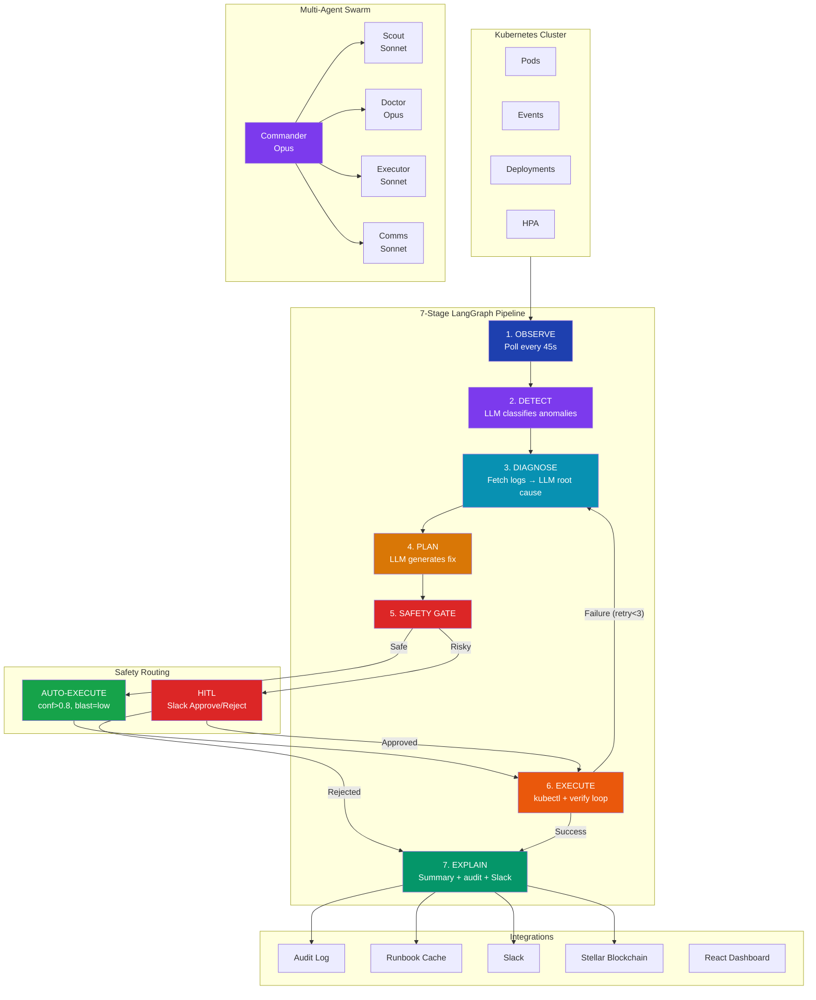
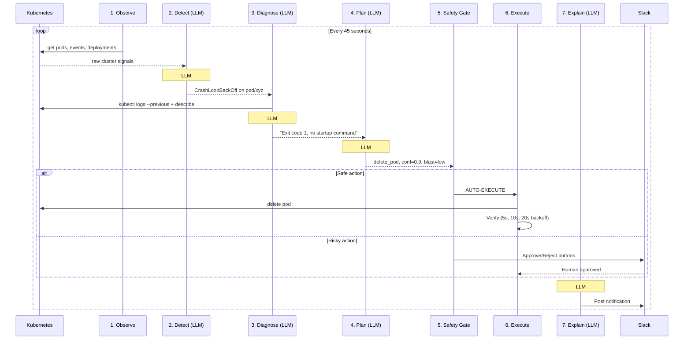
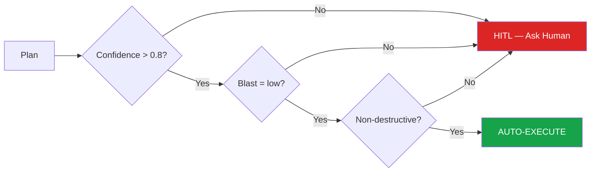
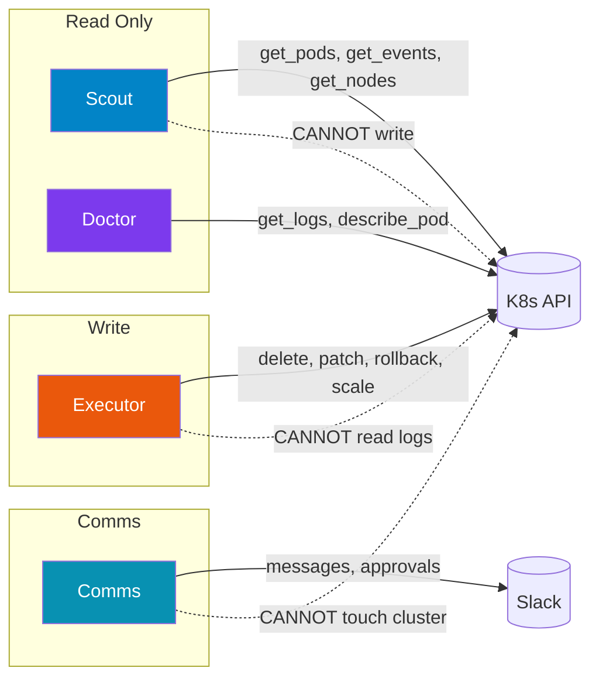
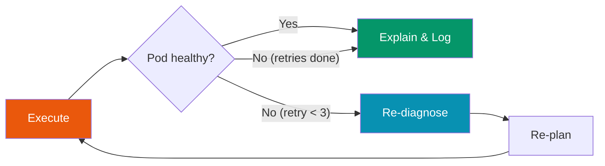

# K8sWhisperer — Architecture & Agent System

## Our 5 Agents

| Agent | Model | Role | Tools |
|-------|-------|------|-------|
| **Commander** | Opus | Supervisor — decides which agent to call | Delegates only |
| **Scout** | Sonnet | Cluster recon — gathers data | `get_pods`, `get_events`, `get_nodes` (READ-ONLY) |
| **Doctor** | Opus | Root cause analysis — deep reasoning | `get_logs`, `describe_pod` (READ-ONLY) |
| **Executor** | Sonnet | Remediation — executes fixes | `delete_pod`, `patch_deploy`, `rollback` (WRITE) |
| **Comms** | Sonnet | Notifications — talks to humans | `send_slack_message`, `send_approval` (SLACK) |

---

## Full System Architecture

---

## Pipeline Flow — Step by Step

---

## Safety Gate Decision

**All 3 must be true for auto-execution:**
- Confidence > 80%
- Blast radius = low (affects 1 pod only)
- Action is NOT in destructive list (rollback, drain, cordon, force-delete)

---

## Agent RBAC Isolation

Each agent only has the tools it needs. Scout can look but can't touch. Executor can fix but can't read sensitive logs. This is **RBAC at the agent level**.

---

## Self-Correction Loop

If a fix fails, the agent doesn't give up — it re-analyzes with the failure context and tries a different approach. Up to 3 retries.

---

## Where LLM is Called (4 times per incident)

| Stage | LLM Call | Input | Output |
|-------|----------|-------|--------|
| **Detect** | LLM #1 | Raw cluster events (pods, statuses, K8s events) | Anomaly classification (type, severity, confidence) |
| **Diagnose** | LLM #2 | kubectl logs, describe, events for specific pod | Root cause analysis citing evidence |
| **Plan** | LLM #3 | Diagnosis text | Remediation plan (action, confidence, blast_radius) |
| **Explain** | LLM #4 | Full incident context | Plain-English summary for humans |
